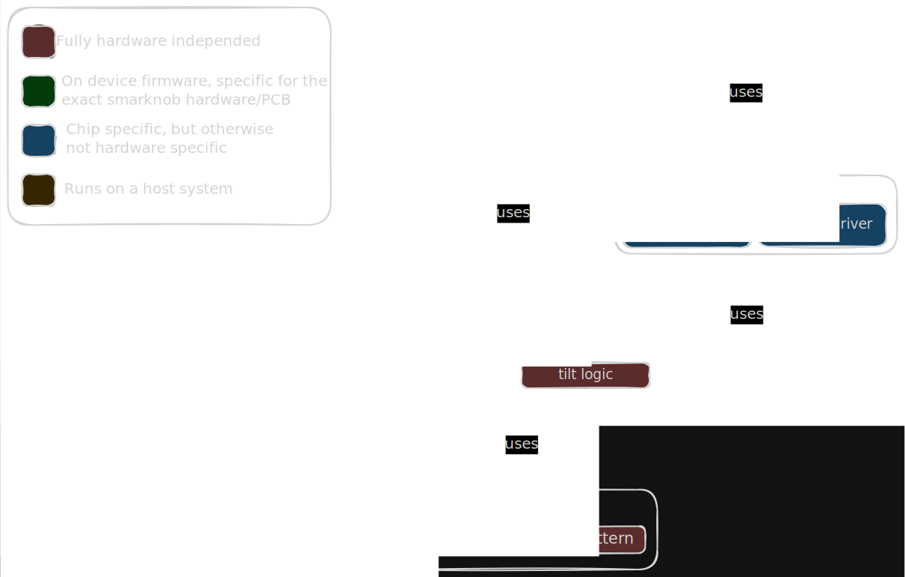

# Concept for haptic programming for the Smartknob

## Software overview

The software stack is composed of a few layers which serve different purposes.

Consider the following diagram:


The big boxes represent rust crates and the smaller boxes within them represent subsystems which can be used independently of each other.
subsystems may be replaced by custom implementations by users of the library as long as some basic communication principals are kept in mind.

### The layers:

* The `haptic_lib` is a create which contains curve definitions. This crate is kept so generic that it can be used by both the embedded system as well as a potential PC application. This will contain builders which can be used to construct curves/patterns. It may also come with a predefined set of ready to use curves and patterns

## The `smartknob_core` crate

The `smartknob_core` crate implements all major shareable sub-components of the smartknob in a non hardware specific way. No PCB specific or even CPU architecture specific things are allowed in here.

### The haptic core

The haptic core is responsible for playing back haptic curves and patterns, it also contains the FOC algorithms, non-linearity corrections, gear ratio configuration

### The settings handler

A lot of sub-components need some sort of calibration/configuration data. So it makes sense to have one generic way of handling these.
This is closely connected with the flash handler and implemented in such a way that it can be used alongside other setting systems for other components outside of the smartknob "ecosystem".

### Additional components

Even somewhat custom logic can be placed here if it makes sense to share across different hardware implementations. But they still have to keep the constraint to be hardware independent.

For example the calculations needed for knob tilt and press detection via inductive sensors could be placed here.


## The `smartknob_esp32` crate

The `smartknob_esp32` crate takes the generic constructs from `smartknob_core` and concretely implements them for the ESP32 controllers. This for example means implementing the interfacing with the actual flash driver of the ESP or adding hardware specific drivers for example the MCPWM peripheral of the ESP32.


## The `smartknob` crate

Maybe these would even be a single git repo specific to one specific hardware.

The `smartknob` crate is the crate which brings it all together. It is the most hardware specific, and a single implementation may be only usable on one specific hardware device. This crate basically is what configures all sub-components from all other crates and defines how they connect, which pins they should use etc.
This is also where special one-off features would be implemented. These could for example be some custom buttons, vibration motors, etc.

The UI would probably best be implemented in its own crate and then be pulled in inside the `smartknob` crate.
Events for updating the UI state and also interfaces to allow the UI to set settings, update curves etc. can be provided and be connected together in the `smartknob` crate.


## The `smartknob_core` crate

The main idea would be to have 2 layers of configuration where higher layers take precedence over lower ones.

The main goal of this concept is to create a framework of how haptic systems can be described.

### `Layer0` - Haptic curve

This is the main layer. It runs the haptic curve.
The haptic curve defines any sort of haptic feedback which is based on the rotational state of the knob.
This usually entails things like end-stops, sticky detents or sharp snaps when rotating over a defined angle.

A haptic curve defines how much torque and in which direction this torque should be applied at any given angle.
As an example, [here](media/haptic-curve-on-off.html) is the curve of the ON/OFF demo of the original smartknob firmware.


#### Serialization

A haptic curve should be serializable to the wire.
My current intention of doing this, is to keep a simple and user writable approach (but users may use fancy UIs or higher level builder APIs to actually construct these curves):

A Haptic curve consists of a sequence of references to `segment`s.
A `segment` consists of a sequence of `part`s.
One `part` defines the torque output over one section of rotation.
Parts themselves have a width which determines where in their curve the torque output should be taken from when the system resides within this curve.
The width of a `segment` is determined at runtime.
By doing this `segment`s can be reused multiple times if they for example describe a repeating pattern.
References to `segment`s may also define a scale which allows to simply reuse the same segments for different intensities of the same patterns.
In general haptic curves should define torque values between 1 and -1. For a particular system these curves may then be further scaled to a system specific output. More powerful systems may scale down, while weaker systems could try to compensate by scaling up.

Consider the following pseudo serialized data which describes a dial with an end stop on each side, which resets the dial into its left or rightmost extreme state, and 4 possible positions which the dial will very eagerly snap to.


In this example the left and right end-stops are going to be scaled with the rest of the haptics, so the left end-stop will be at 20% motor strength while the right end-stop will be at 80% strength.
This should ofc not be done in a real system, but since this is an example I wanted to keep it simple.
```rust
HapticCurve {
    segments: [
        Segment {
            parts: [
                Eased {
                    width: 0.5,
                    start_value: 1.0,
                    end_value: 0.0,
                    easing: Easing::Sinusoidal(EasingType::Out)
                },
                Eased {
                    width: 0.5,
                    start_value: 0.0,
                    end_value: -1.0,
                    easing: Easing::Sinusoidal(EasingType::In)
                },
                Eased {
                    width: 0.5,
                    start_value: 1.0,
                    end_value: 0.0,
                    easing: Easing::Sinusoidal(EasingType::Out)
                },
                Eased {
                    width: 0.5,
                    start_value: 0.0,
                    end_value: -1.0,
                    easing: Easing::Sinusoidal(EasingType::In)
                },
            ]
        }
    ],
    curve: [
        SegmentRef {
            segment_index: 0,
            scale: 0.2,
        },
        SegmentRef {
            segment_index: 0,
            scale: 0.4,
        },
        SegmentRef {
            segment_index: 0,
            scale: 0.6,
        },
        SegmentRef {
            segment_index: 0,
            scale: 0.8,
        },
    ]
}
```

### `Layer1` - Haptic patterns

This layer is responsible for playing back quick one time feedback patterns.
Since these patterns fully occupy the motor they always take precedence over the layer 0 haptic curves.
This would usually be used for creating non-sticky detents or to notify the user about some sort of event which happened.

A haptic pattern is a simple sequence of motor torque values and delays.

The decision of when a haptic pattern is active on layer 1 is made via looking up a second curve.
This curve consists of a sequence of segments.
There are 2 types of segments:

#### `Space` segments

These only consist of a `width` and while the knob is positioned within such a section `Layer1` is considered inactive.


#### `HapticEvent` segments

These always considered to have zero width but they do come with an `activation_overlap` and a `deactivation_gap`.
These 2 values produce an `activation zone` and a `deactivation zone`.
- The `activation zone` is directly defined by `activation_overlap`.
- The `deactivation zone` is the same as the `activation zone` but wider by the amount defined by the `deactivation_gap`.

Upon entering the `activation zone` a specified `haptic pattern` is played back in its entirety.

- While the pattern is being played `Layer0` is deactivated.
- Once finished `Layer0` immediately becomes active again.
- Once the `HapticEvent` had been activated the user must leave the `deactivation zone` before the `HapticEvent` can be triggered again by entering the `activation zone` again.

To illustrate this consider the following diagram:

TODO

#### Serialization

Similar to the Haptic curve this serialization will work exactly the same way

## The UI crate

The UI is somewhat decoupled from the whole haptic system.
The UI will mainly receive events from the haptic system and
can use them to render some sort of visualization of the currently playing back haptic curve.
The UI may also trigger a change of the currently active `haptic curve`.

In this concept the UI is viewed as more of a output mask and has no strong ties to the currently playing curve.
This could be an issue as synchronization and more importantly conveying of information about the haptic curve and how it should be rendered is left to the UI to figure out.

### Defined UI events

The current UI framework (slint-ui) is cross platform. As such interfacing with it in the current firmware is done mainly through events.
These events mimic a mouse and keyboard control scheme. This allows for easy and quick development of the UI components on a host system and then allows for deploying to the embedded target without any surprises.

The following events should be consumed by the UI component of the system and used to render a visualization:

* Encoder position: The current encoder position will be updated for every render iteration and will always reflect the most up to date encoder value.
    - In the current UI framework this is translated to a mouse wheel/scroll event with gets passed a delta X axis movement since the last time this event was sent.
* Knob press and tilt events: These events are emitted when the knob was pressed down/released or tilted into any of the 4 cardinal directions/or released from such a tilt
    - In the current UI framework these are mapped to the arrow keys and the knob press is mapped to the enter key
* Additional button events may be sent via the same channels.
    - Also these could simply be mapped to key strokes

### Serialization to the wire

As of right now I have no concept, or even intent of supporting serialization of the UI.

The only viable way I can see of doing this is to have a fixed set of predefined screens with configuration.
This configuration could then be bundled together with a haptic curve and a haptic pattern layer to form one package which can be serialized and used to set the whole state of the system at once.
